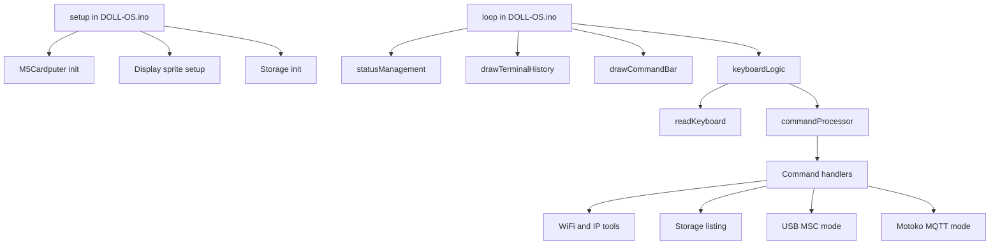

# DOLL-OS Architecture

## Host And Target

- Current development host OS: Windows
- Target runtime: ESP32-based M5Cardputer running as a single Arduino sketch split across `.ino` and header files
- UI model: framebuffer-style sprites for a status bar, terminal area, and command bar
- Execution model: single-threaded, event-loop driven firmware with a few intentionally blocking operations

This project is not a desktop operating system. It is an embedded terminal shell for the M5Cardputer, developed from a Windows workstation and deployed to the device through the Arduino toolchain.

## High-Level Structure

## Runtime Model

### 1. Boot

`setup()` in `DOLL-OS.ino` initializes the M5Cardputer, prepares three sprites, draws a boot splash, and mounts LittleFS plus the SD card.

### 2. Main Loop

`loop()` continuously:

1. Updates device state through `M5Cardputer.update()`.
2. Refreshes the status bar through `statusManagement()`.
3. Renders terminal history through `drawTerminalHistory()`.
4. Renders the current input line through `drawCommandBar(currentCommand)`.
5. Polls the keyboard through `keyboardLogic()`.

This is a cooperative loop. There is no scheduler, task system, or background worker abstraction in the current design.

### 3. Input And Command Dispatch

`hardware.ino` owns keyboard input. `readKeyboard()` appends printable input to the active buffer, handles backspace, and returns `true` when Enter is pressed.

`CommandProcessor.ino` turns the entered line into up to four space-delimited tokens and dispatches by command name through a small table of function pointers. `clear` is handled inline because it mutates terminal history directly.

## Subsystems

### Display And Terminal UI

- `DOLL-OS.ino` creates sprites for the status bar, terminal body, and command bar.
- `terminal.ino` manages terminal history, line wrapping, scrolling, and all primary shell rendering.
- Terminal history stores already-wrapped display rows, not a separate canonical shell transcript.

### Shared State

`global.h` stores the global state used by the sketch:

- battery metrics and refresh counter
- active command buffer
- SD mount flag
- sprite instances
- terminal history rows, colors, and scroll position

This makes cross-file access simple, but it also means most modules are tightly coupled through shared globals.

### Storage

`storage.ino` mounts:

- LittleFS for internal flash storage
- SD card storage over a dedicated SPI bus

It also provides the `ls` command, which can list either LittleFS or SD paths.

### Networking

`wifi.ino` provides Wi-Fi state, network scan, connect, and credential persistence in LittleFS at `/wifi.cfg`.

`ip.ino` builds on Wi-Fi connectivity to provide:

- local interface information
- a ping-based subnet scan
- an ARP scan via `esp32ARP`

`ping.ino` exposes direct ICMP echo tests.

### USB Mass Storage

`usb_msc.ino` exposes the SD card to a connected host over TinyUSB MSC. This mode is intentionally modal and blocking: once enabled, the device stays in USB-storage mode until the user presses `Fn + \``.

### Motoko MQTT Client

`motoko.ino` launches a modal MQTT chat session over the existing terminal UI. It reuses the normal terminal history and keyboard input path instead of introducing a second UI stack.

### Remote Sessions (SSH And Telnet)

`RemoteSession` (declared in `global.h`, implemented in `RemoteSession.ino`) is a shared abstract base class for character-oriented remote sessions. It owns the modal poll/pump/redraw loop and raw-keystroke capture (via `readRawKeyBytes()` in `hardware.ino`): every keypress is forwarded to the remote immediately rather than buffered locally and sent on Enter, which is what real ptys and telnet character-mode servers expect (arrow keys, ctrl+c, backspace-before-enter, and interactive/full-screen remote programs all depend on it). The local escape chord is `Fn+Q`. A subclass only supplies the transport (`pumpIncoming`, `isClosed`, `sendBytes`, `drawInputRow`, `onClosed`).

`ssh.ino` launches a modal SSH session over the existing terminal UI, following the same pattern as `motoko.ino`. Almost all protocol/crypto work is delegated to `libssh_esp32`. The password prompt is still collected as a local masked buffer (one auth call needs it all at once); once authenticated, a `SshShellSession : RemoteSession` takes over the interactive PTY channel. It does not verify host keys against a known-hosts store.

`telnet.ino` is a plain TCP client with just enough IAC option negotiation (RFC 854/855) to stay usable: it refuses options it doesn't implement, but accepts `ECHO`/`SUPPRESS-GO-AHEAD` when a server offers them, which is what puts well-behaved servers (e.g. telehack.com) into character-at-a-time mode. `TelnetSession : RemoteSession` handles the live connection end to end.

## Command Surface

The current shell commands are:

- `help`
- `clear`
- `wifi`
- `ip`
- `ls`
- `usb`
- `ping`
- `motoko`
- `ssh`
- `telnet`

Grouped commands already follow a subcommand pattern, especially `wifi` and `ip`. That is the clearest existing extension point for future features.

## Important Design Characteristics

### Strengths

- Small and easy to follow control flow
- Minimal abstraction overhead, which suits Arduino firmware work
- Reuse of the same rendering and input path across shell and modal tools

### Constraints

- Several features are blocking, including Wi-Fi scans, ping, USB mode, and Motoko session handling
- Parsing is intentionally simple: space-delimited and capped at four tokens
- Global mutable state in `global.h` couples most modules together
- There is no filesystem service layer, task system, or persistent shell history abstraction yet

## File Ownership Map

- `DOLL-OS.ino`: boot and main loop
- `global.h`: shared global state, sprite instances, and the `RemoteSession` base class
- `RemoteSession.ino`: shared modal loop for character-oriented remote sessions (ssh, telnet)
- `hardware.ino`: keyboard polling, input editing, and raw-keystroke translation for remote sessions
- `terminal.ino`: terminal rendering, history wrapping, status bar, boot and USB overlay UI
- `CommandProcessor.ino`: tokenization and command dispatch
- `storage.ino`: LittleFS and SD mount, `ls`
- `wifi.ino`: Wi-Fi scan, connect, saved credentials
- `ip.ino`: IP info, ping sweep, ARP scan
- `ping.ino`: direct ping command
- `usb_msc.ino`: USB mass-storage mode backed by SD
- `motoko.ino`: modal MQTT chat client
- `ssh.ino`: modal SSH client (`SshShellSession`)
- `telnet.ino`: modal telnet client (`TelnetSession`)
- `config.h`: Motoko default broker settings

## External Dependencies

The architecture currently relies on these platform or library layers:

- `M5Cardputer`
- `WiFi`
- `LittleFS`
- `SD` and `SPI`
- `USB` and `USBMSC`
- `ESP32Ping`
- `esp32ARP`
- `PubSubClient`
- `libssh_esp32`

## Practical Summary

DOLL-OS is best understood as a compact embedded shell for the M5Cardputer. The design centers on one cooperative loop, one shared terminal UI, and a command dispatcher that hands work to feature-focused modules. Development is happening from Windows, but the runtime architecture itself is the embedded ESP32 firmware shown in this sketch layout.